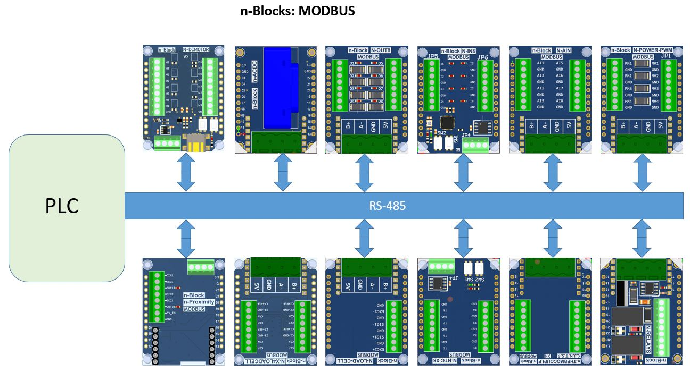

# n-Modbus 
m-Blocks with Modbus interface
  

   * **N-IN8** Octal digital inputs interface with optocouplers, I2C and Modbus
   * **N-AIN** Octal Analog Inputs n-Block with Modbus or I2C interface
   * **N-PROXIMITY** AD7150 based proximity sensor with standalone or Microprocessor/Modbus  
   
   * **N-OUT8** Octal Mosfet OUTPUT, I2C and Modbus
   * **N-DCMOTOR** Octal motor driver, UART, I2C and Modbus
   * **N-POWER-PWM** Dual PWM Power Outputs with Modbus interface
   * **N-RELAYS** Two Relays Output board, GPIO, I2C, Modbus  

   * **N-X4LOADCELL** Quad LoadCell Interface, Modbus
   * **N-LOAD-CELL** Single LoadCell Interface, Modbus
   * **N-NTC** Octal NTC sensor Modubus or I2C interface
   * **N-THERMOCOUPLE** Quad Thermocouple sensor Interface, Modbus Interface
   * **N-ACDC** Non Invasive 50A current sensor Modbus

 